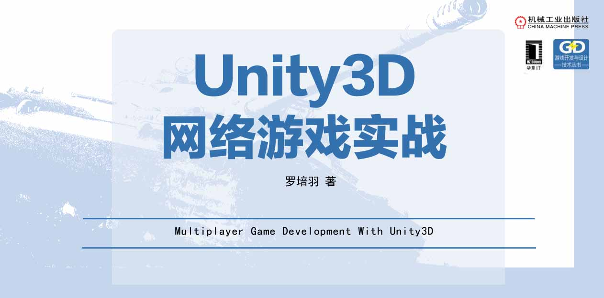

# 《Unity3D网络游戏实战（第二版）》

学了Unity，能做游戏。可是怎样制作多人**网络游戏**，怎样解决网络游戏中的**卡顿**，**掉线**问题？怎样做到实时的**同步**？本书或许能给予读者启发。

新华书店、京东、亚马逊、淘宝、当当等主流渠道均有销售

资源/补充篇/更多学习建议：
https://luopeiyu.github.io/unity_net_book/

## 我能学到什么？

《Unity3D网络游戏实战（第二版）》以制作一款完整的多人坦克对战游戏为例，详细介绍网络游戏的开发过程。透过本书，读者能够掌握Unity网络游戏开发的大部分知识，能够深入了解TCP底层机制，能够亲自搭建一套可重复使用的客户端框架，也能够从框架设计中了解商业游戏的设计思路。本书分为三大部分，会循序渐进，结合实例，深入的讲解网络游戏开发所需的知识。

## 示范工程（Final）截图

游戏大厅

战斗场景

