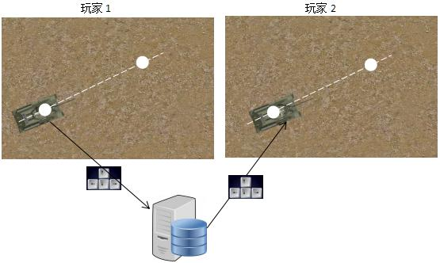
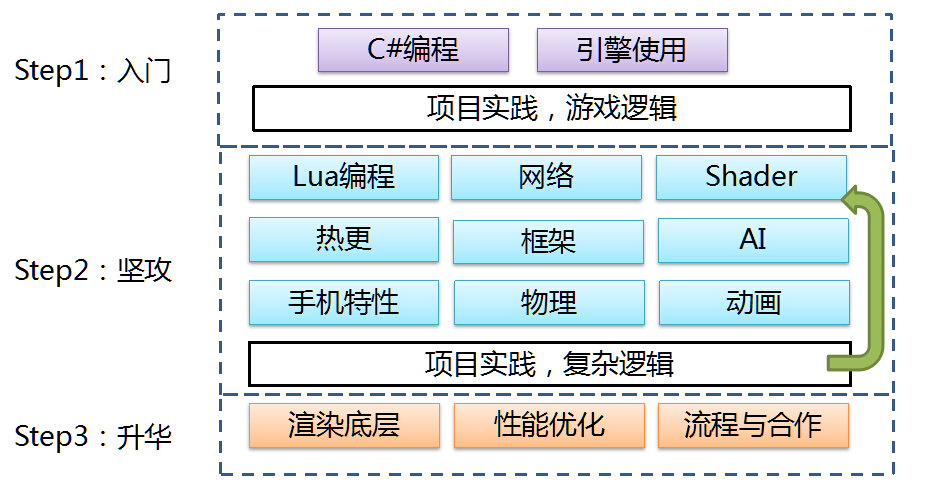
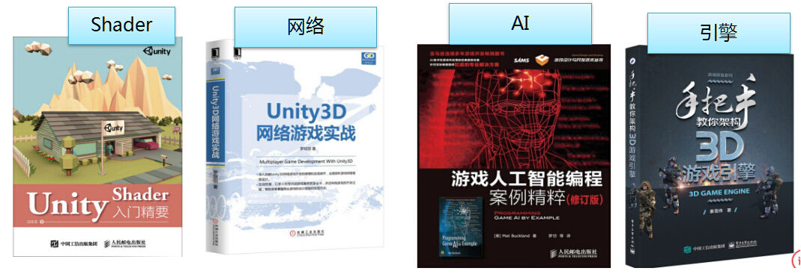

# 《Unity3D网络游戏实战》揭示网络游戏开发秘籍！

怎样制作**多人网络**对战游戏？怎样解决网络游戏中常见的卡顿、频繁掉线问题？怎样搭建一套可商用的Unity网络框架？本书也许能给读者们些许灵感。

**购买书籍** 新华书店、京东、亚马逊、淘宝、当当等主流渠道均有销售

**宣传视频** [B站](https://www.bilibili.com/video/av29747258)

**资源下载** [百度网盘](https://pan.baidu.com/s/1XhYKHJYjWTtGAqMb3uBYxQ)    密码：hxuz


## 【看完书我能做什么？】
独立开发一款有一定复杂度的网络游戏！

透过《Unity3D网络游戏实战（第二版）》，读者能够掌握Unity网络游戏开发的大部分知识，能够深入了解TCP底层机制，能够亲自搭建一套可重复使用的客户端框架，也能够从框架设计中了解商业游戏的设计思路。循序渐进，结合实例，讲解网络游戏开发所需的知识。

### 特色1：实践出真知，动手做游戏

《Unity3D网络游戏实战（第二版）》以制作一款完整的多人坦克对战游戏为实例，详细介绍网络游戏的开发过程。坦克项目包含登录注册模块、房间模块（游戏大厅）、战斗模块。

图：示范游戏截图


### 特色2：深入了解TCP，解决暗藏问题

TCP协议至今已有三四十年的历史，当时的设计理念和现今的理念并不完全相同。以前人们注重技术的灵活性，会留下很多可供用户自由选择和处理的功能。但对于初学者，这些灵活性却成为“大坑”。

在网络游戏的运营过程中，经常会有玩家反馈“游戏登录不上”“游戏网络很卡”等问题，导致这些问题的有可能是游戏程序没写好，在特殊的条件下暴露了出来。本书会探讨怎样正确发送数据？怎样正确接收数据？怎样正确关闭连接？这些常见的问题。

图：书中通过很多图片，介绍TCP、缓冲区的结构和关系


图：图文并茂，讲解协议格式


### 特色3：搭建稳健的网络模块

商业级的程序和Demo级的程序的一大区别在于，商业级的程序会处理各种意外情况。当客户端程序连接服务端后，再次连接服务端会发生什么？当客户端发起连接而回调函数尚未返回时，再次连接是否会发送异常？当缓存区满了，是否会出现异常？这些都需要考虑。


图：通过图表描绘网络模块的整体设计


### 特色4：探求适宜的同步算法

“同步”是网络游戏的一大课题，也是很难做到完美的课题。网络传播会有延迟，玩家看到的运动轨迹和真实轨迹会有误差，怎样减少误差呢？简单粗暴的高频率的发送同步信息并不能解决问题，怎样运用跟随算法、预测算法、甚至帧同步做到较好的同步效果呢？


图：详解网络同步




## 【会不会很难？】

书籍结构比较合理，循序渐进，只要有点Unity基础，不难的。

### 第一部分“扎基础”
主要介绍TCP网络游戏开发的必备知识，包括TCP异步连接、多路复用的处理，包括怎样处理粘包分包，怎样发送完整的网络数据，怎样设置正确的网络参数。第三章《实践出真知：大乱斗游戏》便会介绍一款简单网络游戏开发的全过程，再在后续章节中逐步完善它。

### 第二部分“搭框架”
主要介绍了商业级客户端网络框架的实现方法，这套框架具有较高的通用性，解决了网络游戏开发中常遇到的问题，且达到极致的性能要求，可以运用在多种游戏上。书中还介绍了一套单进程服务端框架的实现，服务端框架使用select多路复用，做到底层与逻辑分离，具有消息分发，事件处理等模块。

### 第三部分“做游戏”
通过一个完整的实例，讲解网络游戏的设计思路。包括游戏实体的类设计、怎样组织代码、怎样实现游戏大厅（房间系统）、怎样实现角色的同步。这一部分会使用第二部分搭好的框架，然后一步步做出完整的游戏项目。


## 【补充篇】

如果读者反映哪些地方看不懂，或者哪些地方有比较大的漏洞，会在这里做补充。
或者作者会补充一些内容，比如做个摇杆然后在手机上跑。
  
[设计Unity网络模块,该用异步还是多路复用?](https://zhuanlan.zhihu.com/p/54870575 "设计Unity网络模块,该用异步还是多路复用?")  

## 【勘误】

书中错漏的地方会在这里说明  

##### 第一次印刷  
  
1.1 P2 图1-3印刷错误，将图中右侧的 ③客户端 改为 ③服务端  
  
1.3.2 P9 代码段印刷错误：将`socket.Conn ct("127.0.0.1", 8888);`改为`socket.Connect("127.0.0.1", 8888);  `  
  
2.5.1 P36 错别字：将“发生程序”改为“发生错误”  
  
3.5.1 P68添加Update函数： `void Update() { NetManager.Update();}`  
  
4.3.3 “缓冲区长度大于一条完整数据”一节中，将代码段中buffCount改成bodyLength。具体将  `string s = System.Text.Encoding.UTF8.GetString(readBuff, 2, buffCount);`改为`string s = System.Text.Encoding.UTF8.GetString(readBuff, 2, bodyLength);`  
  
4.3.3 P102 图4-17 图片印刷错误。只看上半部分两条缓冲区的图片即可。  
  
4.3.4 将代码段中buffCount改成bodyLength，具体语句改为`string s = System.Text.Encoding.UTF8.GetString(readBuff, 2, bodyLength);`  
  
4.5.4 代码中的`if(count == ba.length)`应改为`if(ba.length == 0)`  
  
4.6.2 “完整的ByteArray/移动数据”代码段中的CheckAndMoveBytes方法改为
```csharp
        //移动数据
        public void MoveBytes(){
            if(length > 0) {
                Array.Copy(bytes, readIdx, bytes, 0, length);
            } 
            writeIdx = length;
            readIdx = 0;
        } 
``` 
  
4.6.2 “完整的ByteArray/读写功能”Read方法中Array.Copy函数改为`Array.Copy(bytes, readIdx, bs, offset, count);`  
  
4.6.3 P131 代码段中将`if(readBuff.length < bodyLength)`改为`if(readBuff.length < bodyLength + 2)`  
  
6.5.6 “协议名的编码解码”  代码段添加一行if(len <= 0)的判断。具体如下:
```csharp
//解码协议名（2字节长度+字符串）
    public static string DecodeName(byte[] bytes, int offset, out int count){
        count = 0;
        //必须大于2字节
        if(offset + 2 > bytes.Length){
            return "";
        }
        //读取长度
        Int16 len = (Int16)((bytes[offset+1] << 8 )| bytes[offset] );
		if(len <= 0){
			return "";
		}
        ……
    } 
```  
  
  6.8.4 代码段中将`if(readBuff.length < bodyLength)`改为`if(readBuff.length < bodyLength + 2)`  
  
  9.4.1 P282 代码段Init函数的最后一行应该是layer而不是ayer。  
  
  9.4.1 P281 错别字，“层级管理”第1段第2行的“分别有Layer.Panel和Layer.Panel两项”改为“分别有Layer.Panel和Layer.Tip两项”
  
  9.6.2 P298 OnShow和OnClose应监听MsgRegister而不是MsgLogin协议。  
  ```csharp
NetManager.AddMsgListener("MsgRegister", OnMsgRegister);  
NetManager.RemoveMsgListener("MsgRegister", OnMsgRegister);  
```
  
  12.7.2 单词拼写错误，代码段中的“forcastQuat”应改为“forecastQuat”  
  
##### 第二次和第三次印刷  

  2.6.2 P42  “调用Select，程序中设置超时时间为1秒，若1秒内……”应改为“毫秒”
  
  4.6.2 P127 代码ReadInt16()和ReadInt32()改为
```csharp
    //读取Int16
    public Int16 ReadInt16(){
        if(length < 2) return 0;
        Int16 ret = (Int16)((bytes[readIdx+1] << 8) | bytes[readIdx]);
    readIdx += 2;
        CheckAndMoveBytes();
        return ret;
    }

    //读取Int32
    public Int32 ReadInt32(){
        if(length < 4) return 0;
        Int32 ret = (Int32)( (bytes[readIdx+3] << 24)|
                            (bytes[readIdx+2] << 16)|
			    (bytes[readIdx+1] << 8) | 
			      bytes[readIdx] );
        readIdx += 4;
        CheckAndMoveBytes();
        return ret;
    }
```  
  7.3.7 P200 代码段中OnReceiveData前几行代码改为
  ```csharp
    //数据处理
    public static void OnReceiveData(ClientState state){
        ByteArray readBuff = state.readBuff;
        byte[] bytes = readBuff.bytes;
        //消息长度
        if(readBuff.length <= 2) {
            return;
        }
        Int16 bodyLength = (Int16)((bytes[readIdx+1] << 8 )| bytes[readIdx]);
        //消息体
        if(readBuff.length < bodyLength +2){
            return;
        }
        readBuff.readIdx+=2; 
        //解析协议名
	......
```  
 

## 【关于作者】

罗培羽，一名正在制作好玩游戏的程序员。

**关注游戏技术，热爱分享**。

2009年发布《教你用vb制作rpg游戏》；2010年发布《教你制作3DRPG游戏》；2004年出版《手把手教你用c#制作rpg游戏》；2016年出版《Unity3D网络游戏实战（第一版）》。游戏蛮牛专栏作家，知乎专栏游戏研究院。

**记录独立游戏的发展，探寻初心。**

[十六年的长度，记录中国独立游戏](http://games.sina.com.cn/zl/duanpian/2015-04-03/1538151.shtml)

[《仙剑四外传·回到起点》有没有做出来? 揭秘史上最宏大的仙剑同人企划](http://news.17173.com/content/06152018/001003932.shtml)

知乎专栏历代仙剑同人作品


**努力制作好游戏。**

卡布西游、卡布仙踪、卡布魔镜、坦克射击、仙剑5前传之心愿、真人火线2。


## 更多学习建议

Unity的学习框架总结，分为三个阶段。第一个阶段学基础，第二个阶段对特定项目坚攻，第三个阶段学习团队合作和性能优化。




书籍推荐



友情连接
[宣雨松](https://www.xuanyusong.com/)
[冯乐乐](https://candycat1992.github.io/)
[4399校园招聘](http://web.4399.com/campus/)

