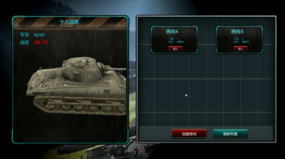
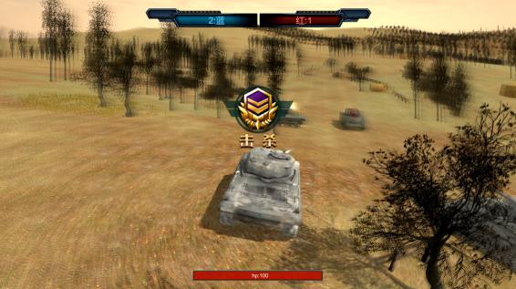
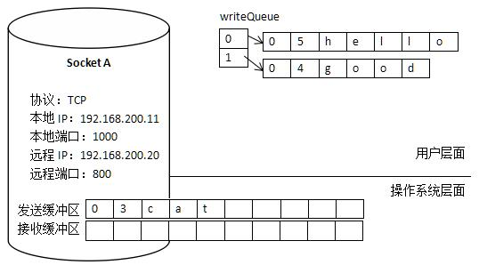
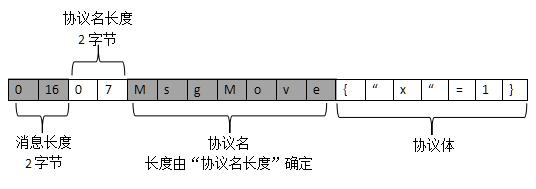
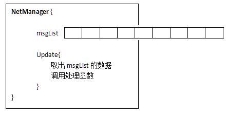
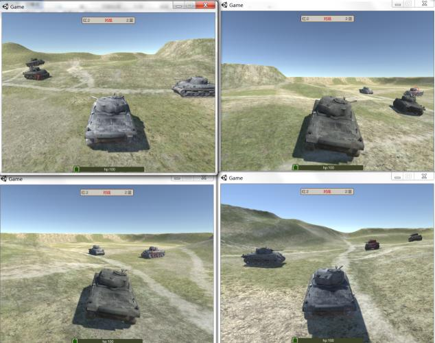

# 《Unity3D网络游戏实战》揭示网络游戏开发秘籍！

怎样制作**多人网络**对战游戏？怎样解决网络游戏中常见的卡顿、频繁掉线问题？怎样搭建一套可商用的Unity网络框架？本书也许能给读者们些许灵感。

购买书籍 尚未发布
宣传视频 [B站](https://www.bilibili.com/video/av29747258)

## 看完书我能做什么？
独立开发一款有一定复杂度的网络游戏！

透过《Unity3D网络游戏实战（第二版）》，读者能够掌握Unity网络游戏开发的大部分知识，能够深入了解TCP底层机制，能够亲自搭建一套可重复使用的客户端框架，也能够从框架设计中了解商业游戏的设计思路。循序渐进，结合实例，讲解网络游戏开发所需的知识。

### 实践出真知，动手做游戏

《Unity3D网络游戏实战（第二版）》以制作一款完整的多人坦克对战游戏为实例，详细介绍网络游戏的开发过程。坦克项目包含登录注册模块、房间模块（游戏大厅）、战斗模块。

示范游戏截图

### 深入了解TCP，解决暗藏问题

TCP协议至今已有三四十年的历史，当时的设计理念和现今的理念并不完全相同。以前人们注重技术的灵活性，会留下很多可供用户自由选择和处理的功能。但对于初学者，这些灵活性却成为“大坑”。

在网络游戏的运营过程中，经常会有玩家反馈“游戏登录不上”“游戏网络很卡”等问题，导致这些问题的有可能是游戏程序没写好，在特殊的条件下暴露了出来。本书会探讨怎样正确发送数据？怎样正确接收数据？怎样正确关闭连接？这些常见的问题。

书中通过很多图片，介绍TCP、缓冲区的结构和关系

图文并茂，讲解协议格式

### 搭建稳健的网络模块

商业级的程序和Demo级的程序的一大区别在于，商业级的程序会处理各种意外情况。当客户端程序连接服务端后，再次连接服务端会发生什么？当客户端发起连接而回调函数尚未返回时，再次连接是否会发送异常？当缓存区满了，是否会出现异常？这些都需要考虑。

通过图表描绘网络模块的整体设计

### 探求适宜的同步算法

“同步”是网络游戏的一大课题，也是很难做到完美的课题。网络传播会有延迟，玩家看到的运动轨迹和真实轨迹会有误差，怎样减少误差呢？简单粗暴的高频率的发送同步信息并不能解决问题，怎样运用跟随算法、预测算法、甚至帧同步做到较好的同步效果呢？

多个客户端的网络同步

## 会不会很难？

第一部分“扎基础”主要介绍TCP网络游戏开发的必备知识，包括TCP异步连接、多路复用的处理，包括怎样处理粘包分包，怎样发送完整的网络数据，怎样设置正确的网络参数。第三章《实践出真知：大乱斗游戏》便会介绍一款简单网络游戏开发的全过程，再在后续章节中逐步完善它。

第二部分“搭框架”主要介绍了商业级客户端网络框架的实现方法，这套框架具有较高的通用性，解决了网络游戏开发中常遇到的问题，且达到极致的性能要求，可以运用在多种游戏上。书中还介绍了一套单进程服务端框架的实现，服务端框架使用select多路复用，做到底层与逻辑分离，具有消息分发，事件处理等模块。

第三部分“做游戏”通过一个完整的实例，讲解网络游戏的设计思路。包括游戏实体的类设计、怎样组织代码、怎样实现游戏大厅（房间系统）、怎样实现角色的同步。这一部分会使用第二部分搭好的框架，然后一步步做出完整的游戏项目。

# 资源下载
github
百度网盘
链接：https://pan.baidu.com/s/1XhYKHJYjWTtGAqMb3uBYxQ 密码：hxuz

# 补充篇
手机游戏系列
等等等等

# 勘误
应该没有很大的错误

# 更多学习建议
关于学习的框架
推荐的书籍
书籍介绍1 2 3
